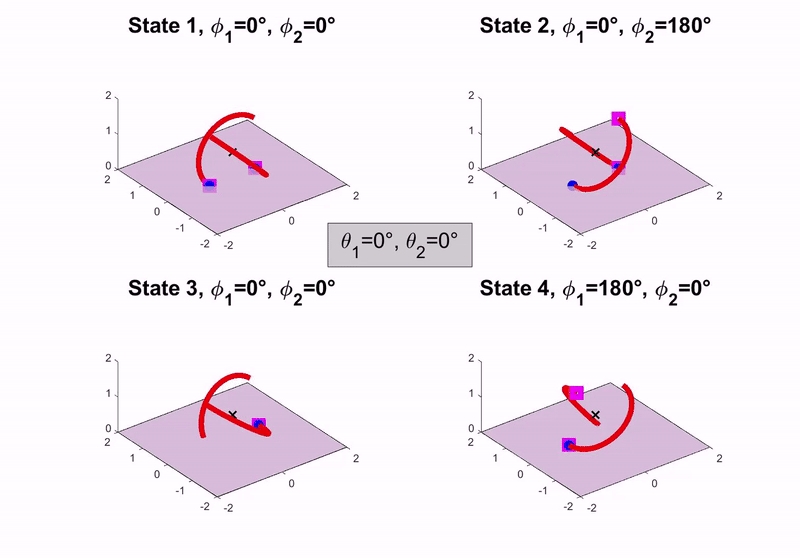
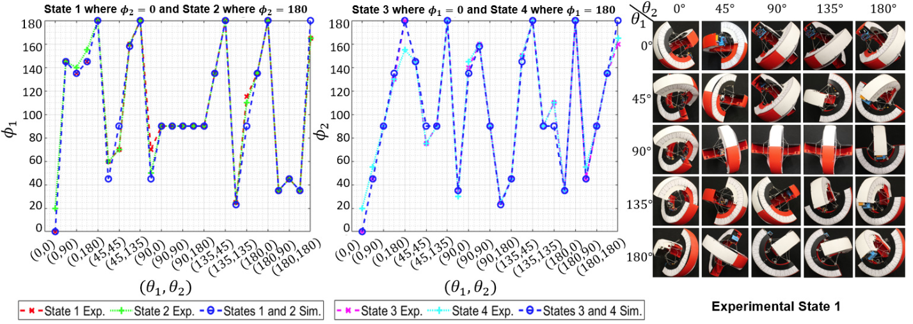

# TeXploR-geometric

[](https://ieeexplore.ieee.org/document/10734217)
[](https://arxiv.org/abs/2407.01865)

This repository contains the code, simulation, and design files for the Tensegrity eXploratory Robot (TeXploR), a novel curved-link tensegrity robot with internal mass shifting and multi-point contact locomotion.  This is supplemental for **Geometric Static Modeling Framework for Piecewise-Continuous Curved-Link Multi Point-of-Contact Tensegrity Robots** published in IEEE RA-L in 2024 and presented at IEEE ICRA 2025.

---


## Overview

TeXploR is a unique tensegrity robot comprised of two semi-circular curved links held together by a continuous elastic cable in 12 prestressed segments. The robot achieves locomotion through internal mass shifting along each link, enabling efficient rolling with enhanced stability (e.g., tip-over resistance on inclines).  Our work presents a geometric modeling framework to describe the hybrid system behavior of TeXploR.

### Key Contributions

- **Curved-Link Tensegrity Design**: Two semi-circular links connected with an elastic cable to maintain structural integrity
- **Internal Actuation**: Internal masses shift along GT2 timing belts for locomotion with ~1:1 (431g:427g) arc to shifting mass ratio
- **Geometric Modeling**: Piecewise continuous approach models the holonomic constraints and pivot points
- **Four-State Hybrid System**: Rolling locomotion through state transitions between ground contact points

---


## Demos

### Internal Mass Shifting


### Rolling Locomotion


### Four-State Transition


---

## Repository Structure

```
TeXploR-geometric/
├── design files/           # CAD files for TeXploR components
│   └── PCBs/               # PCB .brd and .sch files
├── experiments/            # C++ test scripts and experimental data
│   ├── lab_cam_view/       # Overhead view of experiments
│   └── Lauren_cam_view/    # Side view of experiments
├── figure generation/      # MATLAB scripts for generating figures
│   └── simulation figures/ # 4-state static eequilibrium simulations
├── gazebo/                 # Gazebo simulation files and launch scripts
│   ├── custom_worlds/      # World and Launch files
│   │   └── ShelbyQuad/     # DAE and texture files for custom world
│   └── sphericon_test2/    # URDF, launch, config, and mesh files
│       ├── config/
│       ├── launch/
│       ├── meshes/
│       └── urdf/
├── geometric modeling/     # Core geometric modeling MATLAB code
│   └── FixingNonvalidVals  # Checking for nonpositive force values
└── media/                  # Demonstration videos and media
```

---
## Getting Started

### Prerequisites

- MATLAB R2020b or later
- Arduino IDE (for hardware deployment)
- Gazebo (optional, for world simulation)

### Installation

```bash
# Clone the repository
git clone https://github.com/lefaris/TeXploR-geometric.git
cd TeXploR-geometric

# Set up MATLAB path
# Add all subdirectories to your MATLAB path
```

### Running the Geometric Model

```matlab
% Open MATLAB and navigate to geometric modeling directory
cd 'geometric modeling/FixingNonvalidVals'

% For theta1, theta2 input values, find the corresponding
% transformation matrix Tsb and zb, and plot the positions
example = TExploRStatics(0,90)
staticPoses = example.computeStaticPoses()

% You can also access other properties of the static class
case2_Tsb_1 = staticPoses.Case2(1).Tsb
```

### Running Gazebo Simulations (work in progress)

```bash
# Launch Gazebo simulation
cd gazebo
roslaunch sphericon_test2 gazebo.launch
```
---

## Key Results



The MAE between the simulated model and experimental prototype is only 4.36°.

---

## Citation

If you use this work in your research, please cite:

```bibtex
@article{texplor2024,
  title={Geometric Static Modeling Framework for Piecewise-Continuous Curved-Link Multi Point-of-Contact Tensegrity Robots},
  author={Ervin, Lauren and Vikas, Vishesh},
  journal={IEEE Robotics and Automation Letters},
  year={2024},
  volume={9},
  number={12},
  pages={11066-11073},
  doi={10.1109/LRA.2024.3486199}
}
```

**arXiv preprint:** [arxiv:2407.01865](https://arxiv.org/abs/2407.01865)

---
## Updates

- **January 2026:** Updated [TeXploRV2](https://github.com/lefaris/TeXploR-quasi) paper accepted to IEEE ICRA 2026
- **May 2025:** Paper presented at IEEE ICRA 2025
- **December 2024:** Paper published in IEEE RA-L
- **October 2024:** Paper accepted to IEEE RA-L

---
## License

This project is released for academic and research purposes.
